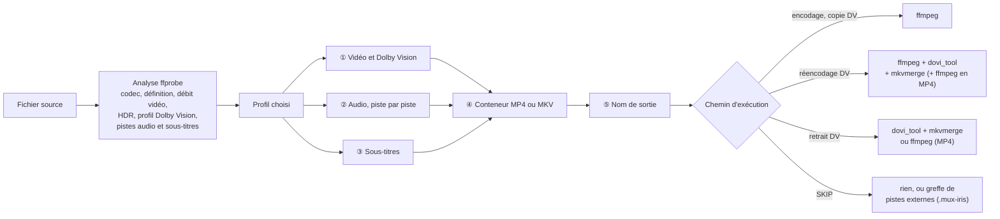
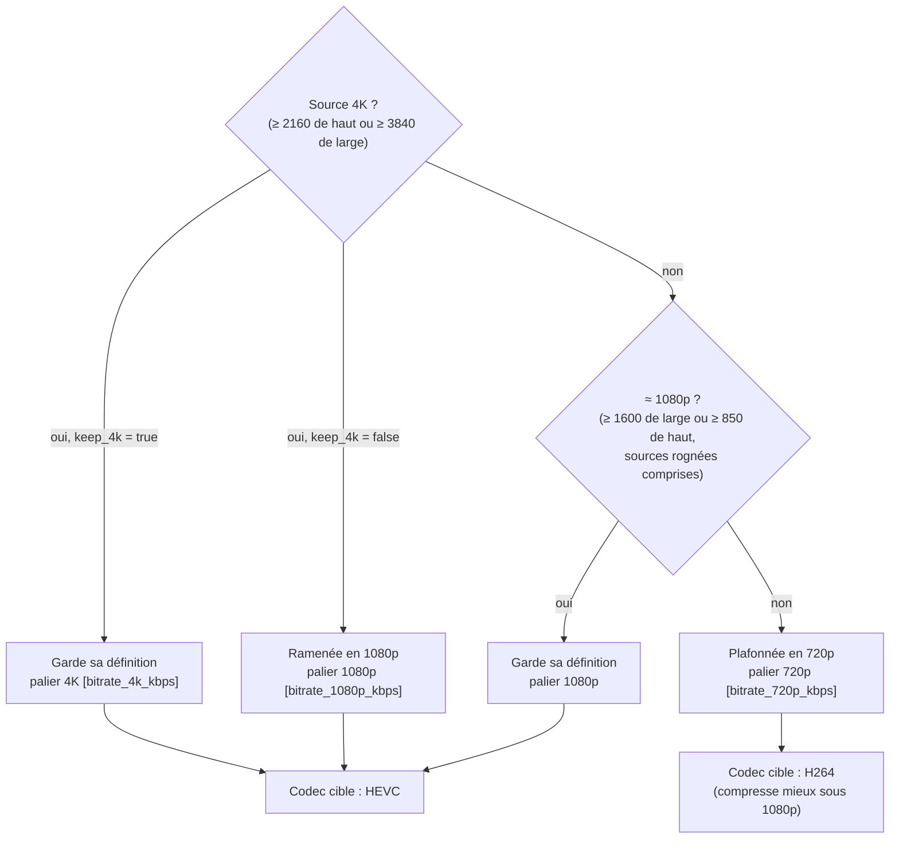
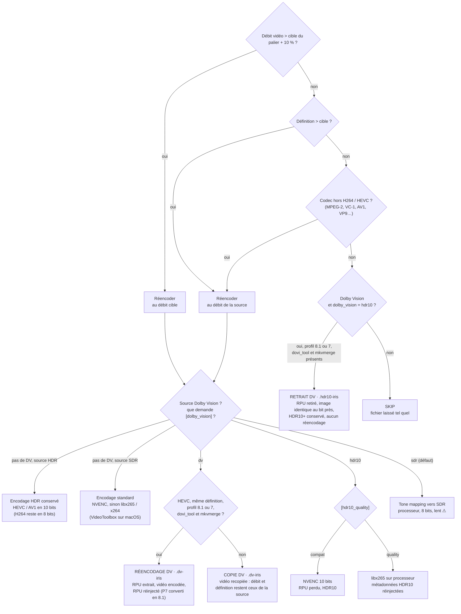
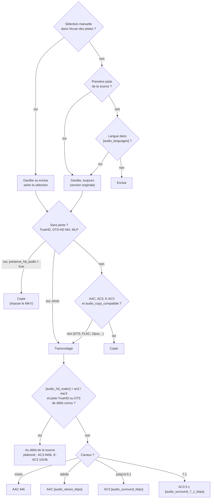
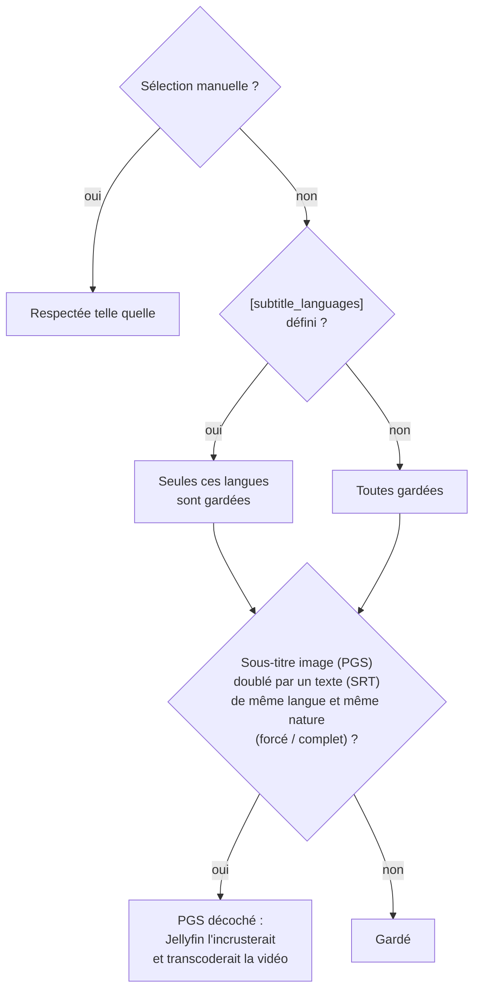
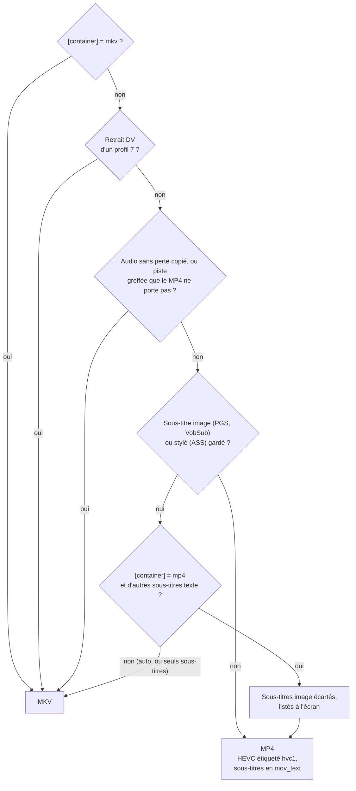

# IRIS ENCODE — Guide d'installation

**Version** : 0.8.9.105 — Windows (support macOS/Linux prévu)

*[English version: README.md](README.md)*

> Ce document présente le projet puis couvre l'**installation**. Pour l'utilisation
> au quotidien — procédures par écran et cas rencontrés — voir [`GUIDE.fr.md`](GUIDE.fr.md). Ce que
> le projet a appris sur les formats, les outils et la chaîne de lecture : `wiki/`.

---

## Pourquoi cet outil

Une bibliothèque de films doit aujourd'hui atteindre plusieurs écrans, et chacun
n'accepte qu'un sous-ensemble différent des formats qu'un fichier peut contenir.
La réponse évidente — tout réencoder vers le plus petit dénominateur commun —
coûte des heures de calcul par film et dégrade une image qui, le plus souvent,
n'avait aucun besoin d'être retouchée. IRIS ENCODE part de l'hypothèse inverse :
**décider ce qu'il faut toucher, et ne toucher que cela.**

### La chaîne de diffusion et ses contraintes

| Maillon | Ce qu'il impose |
|---|---|
| **Serveur Jellyfin** | Tout format non reconnu par le client déclenche un transcodage à chaque lecture. Le vrai coût d'un mauvais format se paie à l'usage, pas une fois. |
| **Téléviseur LG OLED (webOS)** | Aucun format audio sans perte — ni TrueHD, ni DTS-HD MA. Le conteneur MKV est capricieux, le Dolby Vision profil 8 déclenche un remux HLS avec coupures audio, le DTS gèle au saut sur les modèles 2023. |
| **Barre de son en eARC** | Elle décode tout, mais dès que le téléviseur mixe ses propres haut-parleurs avec elle, c'est lui qui décode : aucun train binaire sans perte ne l'atteint. |
| **Clients iOS (Swiftfin)** | Permissifs via VLCKit, qui lit le MKV et le DTS. Le lecteur natif d'Apple est plus strict et ne sait pas changer de piste audio — donc inutilisable sur un fichier multilingue. |
| **Sous-titres image (PGS, VobSub)** | Aucun client ne peut les recevoir tels quels : le serveur les incruste, ce qui force un transcodage vidéo complet. |

L'intersection de ces contraintes est étroite : **HEVC en HDR10, audio E-AC3,
sous-titres texte**. C'est le seul jeu de formats que toute la chaîne accepte
sans qu'aucune machine n'ait à retoucher quoi que ce soit.

### Les choix qui en découlent

- **Ne pas réencoder par défaut.** Un fichier dont le débit vidéo, la résolution
  et le codec sont déjà dans les clous est laissé intact. Le débit comparé au
  seuil est celui de la vidéo seule — celui du conteneur, audio compris,
  enverrait au réencodage des fichiers dont l'image tient largement en dessous.
- **Retirer le Dolby Vision plutôt que de le convertir.** Sur un profil 8.1, la
  couche de base *est* du HDR10 : retirer les métadonnées suffit. Quelques
  minutes, une image identique au bit près, contre des heures de réencodage pour
  un résultat dégradé.
- **Transcoder l'audio au débit de la source**, plutôt qu'à un forfait qui jette
  bien plus que nécessaire sur une piste HD.
- **Laisser le conteneur suivre le contenu.** MP4 quand tout y tient, MKV quand
  quelque chose serait perdu.
- **Un profil par destination.** Les seuils, les langues conservées et le
  traitement du Dolby Vision se règlent par profil, parce qu'un salon et un
  téléphone ne demandent pas le même fichier.

Le reste de l'outil découle de là : une interface qui **montre sa décision avant
de l'appliquer**, fichier par fichier, et qui permet de la contredire.

## Comment IRIS décide, fichier par fichier

Chaque fichier passe par le même arbre de décision. Le profil choisi fixe les
seuils (clés entre crochets) ; l'écran des pistes et la touche de codec
permettent de contredire chaque branche avant l'encodage. Les schémas suivent
`core/decision.py` et `core/encoder.py`.

### Vue d'ensemble



### ① Vidéo et Dolby Vision

D'abord la cible : la définition de sortie et le palier de débit qui s'y
applique.



Puis l'arbre lui-même. Les trois premières questions décident s'il faut
réencoder ; la suite dit comment.



L'AV1 n'est jamais choisi d'office : il se demande à la main, fichier par
fichier. Une source Dolby Vision que rien ne pousse au réencodage reste en
SKIP, Dolby Vision compris, sauf retrait possible.

### ② Audio, piste par piste



Un transcodage ne sort jamais au-delà du 5.1, et le titre de la piste est
réécrit pour ne pas annoncer un format disparu (« TrueHD 7.1 Atmos » devient
« E-AC3 5.1 »). Une piste sans perte transcodée dans un fichier qui garde des
sous-titres passe par une **passe audio préalable** : sans elle, ffmpeg rend
une piste vide sans signaler d'erreur.

### ③ Sous-titres



### ④ Conteneur



En `auto`, le conteneur suit le contenu : MP4 quand tout y tient, MKV quand
quelque chose y serait perdu. Une piste n'est jamais sacrifiée en silence.

### ⑤ Nom de sortie

| Traitement | Suffixe | Exemple |
|---|---|---|
| Encodage HEVC / H264 / AV1 | `.hevc-iris` · `.h264-iris` · `.av1-iris` | `Film.2160p.x265-GRP.mkv` → `Film.1080p.hevc-iris.mp4` |
| Dolby Vision conservé (réencodé ou copié) | `.dv-iris` | `Film.2160p.DV.mkv` → `Film.2160p.DV-iris.mp4` |
| Retrait du Dolby Vision | `.hdr10-iris` | `Film.2160p.DV.mkv` → `Film.2160p.HDR10-iris.mp4` |
| SKIP avec pistes greffées | `.mux-iris` | `Film.mkv` → `Film.mux-iris.mkv` |

Le nom dit ce que le fichier **est**, pas ce qu'était la source : les marques
de codec, de définition (`2160p` → `1080p`), de HDR (`DV` → `HDR10`, toutes
retirées en SDR) et d'audio (`TrueHD.7.1` → `E-AC3.5.1`) sont réécrites, le
groupe de la release est retiré, et une caractéristique déjà annoncée n'est
pas répétée. Rien n'est jamais écrasé : une collision donne `(2)`.

---

## Prérequis

| Composant | Version minimale | Obligatoire |
|-----------|-----------------|-------------|
| Windows   | 10 / 11         | ✓           |
| Python    | 3.11            | ✓ (auto-installable) |
| ffmpeg    | 7.x             | ✓ (auto-installable) |
| ffprobe   | 7.x             | ✓ (inclus avec ffmpeg) |
| dovi_tool | 2.x             | ✗ (optionnel — Dolby Vision) |
| mkvmerge  | 99.x            | ✗ (optionnel — greffe de pistes externes) |
| mpv       | récent          | ✗ (optionnel — visualisation) |
| Outil DVD | ffmpeg BtbN 7+  | ✗ (optionnel — titres de DVD) |
| GPU NVIDIA | driver récent  | ✗ (recommandé — encodage accéléré CUDA) |

---

## 1. Installer Python et ses dépendances

### 1.1 Ne rien faire (recommandé)

Double-cliquez **`launch.bat`**. S'il ne trouve pas de Python 3.11+ utilisable,
il installe le sien et vous n'avez rien d'autre à faire :

```
 [INFO] No usable Python 3.11+ found - setting up the environment.
 No administrator rights needed; everything is written to this folder.

  IRIS ENCODE — Python environment setup
  Downloading uv (x86_64-pc-windows-msvc)…
  uv installed: bin\uv.exe
  Python 3.12…
  .venv environment…
  Dependencies (requirements.txt)…

  Ready — Python 3.12.14 in .venv
```

Ces messages sont en anglais : ils s'affichent avant que la langue de
l'application soit connue.

Comptez deux à trois minutes et environ 140 Mo la première fois. Les fois
suivantes, `launch.bat` constate que tout est en place et démarre aussitôt.

**Aucun droit administrateur n'est requis, et rien n'est écrit hors du dossier
de l'application** — ni dans le PATH, ni dans le registre, ni dans les dossiers
système. Copier le dossier sur une clé, c'est copier l'installation entière :

| Ce qui arrive | Où |
|---|---|
| `uv`, l'exécutable qui va chercher le reste | `bin\uv.exe` |
| L'interpréteur CPython | `bin\python\` |
| L'environnement et ses bibliothèques | `.venv\` |

C'est la convention que suit déjà le reste de l'outillage : ffmpeg, mkvmerge et
dovi_tool arrivent dans `bin/` de la même façon (chapitre 3). Python faisait
exception pour une raison mécanique — le code qui télécharge les outils *est*
du Python, et ne pouvait pas s'exécuter avant lui. C'est ce que `bootstrap.ps1`
corrige, en PowerShell.

### 1.2 Quel interpréteur `launch.bat` retient

Dans cet ordre, le premier qui convient :

1. **`.venv\` local**, s'il est complet — le seul dont les versions de
   bibliothèques soient connues ;
2. **le Python du PATH**, s'il annonce 3.11 ou mieux — évite le téléchargement ;
3. **`bootstrap.ps1`** — installe uv, un CPython et le `.venv`.

Un Python système qui convient est *utilisé*, jamais remplacé. À l'inverse, si
`pip` échoue sur ce Python-là (poste verrouillé, dépôt interne, permissions),
`launch.bat` bascule tout seul sur l'environnement isolé plutôt que de s'arrêter.

### 1.3 Reconstruire l'environnement

Si quelque chose s'est mal passé, ou après une mise à jour de
`requirements.txt` :

```
powershell -ExecutionPolicy Bypass -File bootstrap.ps1 -Force
```

`-Force` reconstruit `.venv` de zéro. Sans lui, le script constate et ne
retélécharge rien : il est fait pour être relancé sans conséquence.

### 1.4 Si Windows bloque un fichier (erreur 4551)

Sur une installation *propre* de Windows 11, **Smart App Control** est actif par
défaut. Il refuse d'exécuter les binaires dont la réputation n'est pas établie,
et le signale par `os error 4551`. `bootstrap.ps1` reconnaît ce blocage et le
nomme.

Depuis la v0.8.4.2 il ne devrait plus le rencontrer : le `.venv` est construit
par le module `venv` de l'interpréteur, dont le lanceur est un fichier connu.
S'il survient malgré tout, deux issues :

- **installer Python 3.12 depuis python.org** (chapitre 2) : ces binaires sont
  signés par la Python Software Foundation, et `launch.bat` les retiendra ;
- **désactiver Smart App Control** — *Sécurité Windows* → *Contrôle des
  applications et du navigateur*. À savoir avant de le faire : la désactivation
  est **définitive**, seule une réinstallation de Windows le réactive.

---

## 2. Installer Python à la main (facultatif)

Rien n'oblige à passer par le chapitre 1. Un Python installé classiquement est
reconnu et utilisé tel quel.

Rendez-vous sur **https://www.python.org/downloads/** et téléchargez la dernière
version **3.11 ou supérieure**. Cochez impérativement, avant *Install Now* :

```
☑  Add Python X.XX to PATH
```

Sans cette case, `launch.bat` ne le verra pas — et installera le sien.

Puis, dans le dossier de l'application :

```
pip install -r requirements.txt
```

| Bibliothèque    | Rôle |
|-----------------|------|
| `textual`       | Interface TUI (Terminal User Interface) |
| `rich`          | Rendu console enrichi (couleurs, tableaux) |
| `tomli-w`       | Écriture de fichiers TOML (config, profils) |
| `requests`      | Téléchargement automatique de ffmpeg |
| `beautifulsoup4`| Fiche AlloCiné et IMDB (`I`) |
| `numpy`         | Corrélation audio pour le recalage des pistes greffées |

Si `pip` est introuvable : `python -m pip install -r requirements.txt`. Sur un
poste à permissions restreintes : `pip install --user -r requirements.txt` —
ou, plus simplement, laissez le chapitre 1 faire le travail.

---

## 3. Installer ffmpeg

ffmpeg est le moteur d'encodage vidéo. IRIS ENCODE le détecte et propose de le télécharger automatiquement s'il est absent.

### Option A — Installation automatique (recommandée)

Lancez IRIS ENCODE (`launch.bat`). Si ffmpeg est absent, le programme propose :

```
[✗] ffmpeg   introuvable
    Télécharger et installer dans ./bin/ ? (o/N)
```

Répondez `o`. Le téléchargement (~30 Mo) s'effectue depuis **gyan.dev** (source officielle Windows) et ffmpeg est extrait dans le dossier `bin/` à côté de `launch.bat`.

### Option B — Installation manuelle dans `bin/`

1. Téléchargez **ffmpeg-release-essentials.zip** depuis : https://www.gyan.dev/ffmpeg/builds/
2. Extrayez les fichiers `ffmpeg.exe` et `ffprobe.exe` depuis le sous-dossier `bin/` de l'archive
3. Placez-les dans le dossier `bin/` d'IRIS ENCODE :
   ```
   iris_encode/
   └── bin/
       ├── ffmpeg.exe
       └── ffprobe.exe
   ```

### Option C — ffmpeg déjà installé dans le PATH

Si ffmpeg est déjà installé sur le système (accessible via `ffmpeg` dans un terminal), IRIS ENCODE le détecte automatiquement — aucune action requise.

---

## 4. (Optionnel) Installer les outils complémentaires

Quatre outils sont optionnels. Aucun n'est nécessaire pour encoder : leur absence
désactive une fonction, elle ne bloque jamais le lancement.

| Outil | Nécessaire pour | Taille |
|---|---|---|
| `dovi_tool` | contenus **Dolby Vision** (probe RPU, métadonnées HDR10) | ~2 Mo |
| `mkvmerge` | **greffe de pistes externes** (VF, sous-titres), **jonction de parties** (`J`) et extraits de contrôle | ~22 Mo |
| `mpv` | **visualisation** d'un fichier ou d'un recalage | ~50 Mo |
| Outil DVD | lecture des **titres d'un DVD** (`VIDEO_TS`) | ~320 Mo |

L'**outil DVD** est un second ffmpeg — le build GPL de BtbN, qui lit les DVD
(libdvdnav) — installé dans `bin/dvd/`, à part du ffmpeg qui encode. Il ne fait
qu'extraire un titre de DVD, sans perte ; l'encodage reste au ffmpeg principal.
Il n'est pas proposé quand le ffmpeg principal lit déjà les DVD (un build BtbN
dans le PATH, par exemple).

### Option A — Installation automatique (recommandée)

Au premier lancement, IRIS ENCODE propose d'installer chaque outil manquant :

```
  dovi_tool absent (optionnel — nécessaire pour le Dolby Vision).
  Télécharger et installer dovi_tool (Dolby Vision) dans ./bin/ ? (o/N) :
```

Répondez `o`. Le binaire est téléchargé depuis la source officielle, vérifié par son
empreinte SHA256, puis extrait dans `bin/`.

> `mpv` n'est publié qu'en archive `.7z` : l'extraction passe par le `tar` livré avec
> Windows 10/11, sans dépendance supplémentaire.

### Option B — Installation manuelle dans `bin/`

Téléchargez les binaires Windows et placez les exécutables directement dans `bin/`
(sans sous-dossier) :

| Outil | Source |
|---|---|
| `dovi_tool.exe` | https://github.com/quietvoid/dovi_tool/releases |
| `mkvmerge.exe` | https://mkvtoolnix.download/downloads.html (archive ZIP 64-bit) |
| `mpv.exe` | https://mpv.io/installation/ (build Windows portable) |
| `dvd/ffmpeg.exe`, `dvd/ffprobe.exe` | https://github.com/BtbN/FFmpeg-Builds/releases (`ffmpeg-n…-latest-win64-gpl-….zip`) — dans le sous-dossier `dvd` |

```
iris_encode/
└── bin/
    ├── dovi_tool.exe
    ├── mkvmerge.exe
    ├── mpv.exe
    └── dvd/
        ├── ffmpeg.exe
        └── ffprobe.exe
```

> Un outil déjà présent dans le PATH système est détecté automatiquement — rien à faire.

---

## 5. Lancer IRIS ENCODE

Double-cliquez sur **`launch.bat`** ou exécutez dans un terminal :

```
launch.bat
```

Le lanceur vérifie, et installe ce qui manque :
- une version plus récente d'IRIS ENCODE, publiée sur GitHub — il propose de
  l'installer (§ 5.2) ;
- un Python 3.11+ utilisable — sinon il en installe un (chapitre 1) ;
- les dépendances Python listées dans `requirements.txt` ;
- ffmpeg / ffprobe, téléchargés dans `bin/` au premier besoin ;
- la validité de la configuration.

Le premier lancement est le plus long : il télécharge ce qui manque. Les
suivants démarrent en quelques secondes.

**Une dernière étape, une fois que tout tourne** : le § 5.1 fabrique un
raccourci « IRIS ENCODE » sur le Bureau, qui ouvre l'application dans
Windows Terminal — le seul hôte au rendu correct (chapitre 10). C'est
l'usage courant ensuite ; `launch.bat` reste là pour le dépannage.

### 5.1 Raccourci Bureau : IRIS_Encode.exe (optionnel)

Un raccourci qui pointe directement sur `launch.bat` s'ouvre dans la console
héritée (conhost), au rendu dégradé (chapitre 10). Le dépôt fournit de quoi
compiler un petit lanceur natif dont c'est la seule fonction : ouvrir
`launch.bat` dans **Windows Terminal** — et, à défaut, dans une console
classique.

1. Double-cliquer sur **`launcher\build.bat`**.
2. Le script décode l'icône (`launcher\iris.ico.b64` → `iris.ico`, via
   `certutil`, livré avec Windows), compile `launcher\IrisEncodeLauncher.cs`
   avec le compilateur C# livré lui aussi avec Windows (le `csc.exe` du
   .NET Framework 4.x — rien à installer) et produit **`IRIS_Encode.exe`**
   à la racine du projet, icône comprise.
3. Il propose ensuite de créer le raccourci « IRIS ENCODE » sur le Bureau.

Le binaire n'est **pas versionné** : un `.exe` dans un dépôt est invérifiable,
chacun compile le sien depuis le source — une trentaine de lignes, qui font
foi. Après une mise à jour du lanceur, relancer `launcher\build.bat` suffit.

> Sur une installation *propre* de Windows 11, **Smart App Control** peut
> refuser un exécutable sans réputation, même compilé localement — même
> famille de blocages qu'au chapitre 1.4. Dans ce cas, un raccourci `.lnk`
> sans `.exe` rend le même service, avec cette cible :
> `wt.exe -d "C:\chemin\vers\iris_encode" cmd /c launch.bat`
> (icône au choix via *Propriétés* → *Changer d'icône* →
> `launcher\iris.ico`, présent après un passage de `build.bat`).

### 5.2 Mises à jour

À chaque lancement — au plus une interrogation de GitHub par heure — le lanceur
compare votre version à la **dernière release publiée** (celle marquée
« Latest »), jamais à un état intermédiaire du code. Si elle est plus récente :

```
  Update available: v0.8.9.1 → v0.9.0.0
  Install now? [Y/n]
```

Les lanceurs s'affichent en anglais : ils tournent avant que la langue de l'application soit connue. `Entrée` (ou `o`, `oui`, `y`) télécharge l'archive, vérifie son empreinte SHA256, remplace
les fichiers de l'application et relance IRIS ENCODE sur la version neuve.
`n` remet à plus tard. Un échec (réseau, archive refusée) n'empêche jamais le
démarrage : la version en place s'ouvre, et la précédente est restaurée si le
remplacement avait commencé.

**Ce qui n'est jamais touché** : `config.toml`, `profiles.toml`, `bin/`,
`.venv/`. La version remplacée est gardée dans `.iris_update/sauvegarde/`
jusqu'à la mise à jour suivante.

| `config.toml`, `[updates] app =` | Effet |
|---|---|
| `"ask"` (défaut) | demander, `O` présélectionné |
| `"auto"` | installer sans demander |
| `"off"` | ne rien vérifier, aucun appel réseau |

Un dossier cloné avec git (présence de `.git/`) n'est jamais mis à jour de
cette façon : `git pull` s'en charge. Si le lanceur Bureau a changé, relancez
`launcher\build.bat` comme indiqué à l'écran.

> **Depuis une version antérieure à la v0.8.9.1**, la mise à jour se fait une
> dernière fois à la main : téléchargez l'archive de la release et extrayez-la
> par-dessus le dossier. Les suivantes se font seules.

---

## 6. Structure des fichiers

```
iris_encode/
├── launch.bat          ← Point d'entrée Windows (double-clic)
├── IRIS_Encode.exe     ← Lanceur Bureau, compilé par launcher\build.bat (auto)
├── bootstrap.ps1       ← Installe Python et ses dépendances, sans droits admin
├── updater.py          ← Mise à jour depuis la release GitHub (appelé par launch.bat)
├── main.py             ← Point d'entrée Python
├── config.toml         ← Configuration générale (éditable)
├── profiles.toml       ← Profils d'encodage (éditable)
├── requirements.txt    ← Dépendances Python
├── version.py          ← Version de l'application (source unique)
├── LICENSE             ← Licence GPL-3.0-or-later
├── README.md           ← Guide d'installation, en anglais (README.fr.md : ce fichier)
├── GUIDE.md            ← Guide d'utilisation, en anglais (GUIDE.fr.md : en français)
├── .venv/              ← Environnement Python local (auto)
├── .iris_update/       ← Cache, sauvegarde et manifeste des mises à jour (auto)
├── bin/                ← uv / python / ffmpeg / ffprobe / dovi_tool / mkvmerge / mpv, dvd/ (auto)
├── data/               ← Sources de téléchargement (embarquées)
├── launcher/           ← Lanceur Bureau : source C#, icône, build.bat
├── core/               ← Logique métier
├── tui/                ← Interface utilisateur
├── locales/            ← Traductions de l'interface (.po, .mo compilés)
├── outils/             ← Outils de développement (traductions)
├── tests/              ← Tests et smoke test TUI
└── logger/             ← Module de journalisation
```

---

## 7. Personnalisation

Les fichiers `config.toml` et `profiles.toml` sont éditables à la main avec n'importe quel éditeur de texte (Notepad, VS Code, etc.).

**`config.toml`** — largeurs des colonnes, langue, chemins, clé OMDb :
```toml
[app]
language = "fr"       # langue de l'interface : "en", "fr" (aussi par F5, puis U)

[tui.browser.columns]
# La colonne "fichier" s'étend automatiquement à l'espace disponible
taille       = 8      # largeur de la colonne taille fichier
resolution   = 12     # largeur de la colonne résolution
audio        = 20     # largeur de la colonne pistes audio
decision     = 12     # largeur de la colonne décision

[meta]
omdb_api_key = ""     # clé gratuite sur omdbapi.com (données IMDB complètes)

[opensubtitles]       # sous-titres depuis F9, touche O (voir GUIDE.fr.md § 2.3)
api_key  = ""         # clé d'application : opensubtitles.com/consumers
username = ""         # compte, exigé pour télécharger (20 / jour gratuit)
password = ""
```

**`profiles.toml`** — profils d'encodage (bitrate, résolution, audio, Dolby Vision) :
```toml
[series_basic]
bitrate_1080p_kbps = 2500
keep_4k            = false
dolby_vision       = "hdr10"
```

---

## 8. Raccourcis clavier (écran d'accueil)

Les principaux ; la liste complète, écran par écran, est au
[`GUIDE.fr.md`](GUIDE.fr.md) § 2, et `H` l'affiche dans l'application.

| Touche | Action |
|--------|--------|
| `Espace` | Cocher / décocher un fichier |
| `A` / `N` | Tout cocher / Aucun |
| `Entrée` | Entrer dans un dossier ; sur un fichier, l'assistant (ou l'écran des pistes en mode manuel) |
| `Retour` | Remonter d'un niveau |
| `W` | Basculer entre assistant et mode manuel |
| `T` | Sélection manuelle des pistes (audio, sous-titres) |
| `F1` | Aperçu — ce qui sera fait, sans rien faire |
| `F2` | Encoder la sélection |
| `R` | Encoder le dossier sélectionné et tous ses sous-dossiers |
| `F4` | Changer de profil d'encodage |
| `F5` | Gérer les profils (créer `N`, éditer `E`, supprimer `D`) |
| `J` | Joindre les fichiers sélectionnés bout à bout en un seul (`part1` + `part2`) |
| `I` | Fiche du film : AlloCiné, puis IMDB avec `Tab` |
| `Tab` / `Shift+Tab` | Colonne suivante / précédente (redimensionnement) |
| `<` / `>` | Rétrécir / élargir la colonne active |
| `H` | Guide des touches |
| `F10` | Quitter |

---

## 9. Métadonnées IMDB (`I`, puis `Tab`)

IMDB bloque le scraping direct. IRIS ENCODE utilise deux modes :

- **Sans clé** : données partielles via l'API de suggestions IMDB (titre, année, type, stars de base)
- **Avec clé OMDb** : données complètes (note, réalisateur, synopsis, genres)

Pour obtenir une clé gratuite (1 000 req/jour) : au lancement, si elle manque,
une fenêtre la demande — **Obtenir une clé** ouvre
[omdbapi.com](https://www.omdbapi.com/apikey.aspx), on colle la clé reçue par
courriel, et elle est vérifiée avant d'être enregistrée. Plus tard : `F5`, puis
`K`. `config.toml` n'a pas à être édité à la main.

---

## 10. Terminal recommandé

IRIS ENCODE utilise Textual pour son interface graphique TUI. Le rendu dépend du **terminal hôte**, pas du shell (cmd ou PowerShell).

| Terminal | Rendu | Notes |
|----------|-------|-------|
| **Windows Terminal** | ✓ Optimal | Recommandé — VT100/ANSI complet, Unicode natif |
| **PowerShell** dans Windows Terminal | ✓ Optimal | Le shell n'a pas d'importance, c'est l'hôte qui compte |
| **cmd.exe** dans Windows Terminal | ✓ Optimal | Idem |
| **cmd.exe** fenêtre classique (conhost) | ⚠ Dégradé | Support ANSI partiel, bordures approximatives |
| **PowerShell** fenêtre classique (conhost) | ⚠ Variable | Même limitation que cmd classique |

> **Windows Terminal** est disponible gratuitement sur le Microsoft Store
> et est installé par défaut sur Windows 11.
> Pour Windows 10 : https://aka.ms/terminal

Un double-clic sur `launch.bat`, ou un raccourci qui le vise directement,
ouvre la **console héritée** — la ligne dégradée du tableau. C'est la raison
d'être du raccourci Bureau du § 5.1 : il ne fait rien d'autre que lancer
l'application *dans le bon hôte*. Si vous ne deviez retenir qu'une chose de ce
chapitre, c'est celle-là.

---

## 11. Résolution des problèmes courants

| Symptôme | Cause probable | Solution |
|----------|---------------|----------|
| `python` non reconnu | Python absent du PATH | Réinstaller Python en cochant *Add to PATH* |
| `pip` non reconnu | pip absent | Utiliser `python -m pip` |
| Écran noir au lancement | Terminal ne supporte pas l'interface TUI | Utiliser Windows Terminal ou cmd.exe classique |
| Encodage lent | Pas de GPU NVIDIA détecté | Normal — encodage CPU activé automatiquement |
| `dovi_tool introuvable` | Optionnel non installé | Voir section 4 — uniquement si fichiers Dolby Vision |
| Erreur à l'import d'un module | Dépendances manquantes | Relancer `pip install -r requirements.txt` |
| `os error 4551` à l'installation | Smart App Control refuse un binaire sans réputation | Voir chapitre 1.4 |
| Windows bloque `IRIS_Encode.exe` | Smart App Control, même cause qu'au 1.4 | Le raccourci `.lnk` sans `.exe` du § 5.1 rend le même service |
| `csc.exe introuvable` au build | .NET Framework 4.x désactivé | *Fonctionnalités facultatives* de Windows, ou https://aka.ms/net48 |
| Le raccourci ouvre une console noire | Windows Terminal absent : le lanceur bascule sur `cmd` | Installer Windows Terminal (chapitre 10) |
| IMDB : note/synopsis absents | Clé OMDb non configurée | Voir section 9 |

---

## 12. Désinstallation

IRIS ENCODE ne modifie aucun paramètre système. Pour désinstaller :

1. Supprimez le dossier `iris_encode/`
2. (Optionnel) Désinstallez les bibliothèques Python : `pip uninstall textual rich tomli-w requests beautifulsoup4 numpy`

Les fichiers `config.toml` et `profiles.toml` sont supprimés avec le dossier.


---

## 13. Licence

IRIS ENCODE est un logiciel libre, distribué sous **GNU General Public License,
version 3 ou toute version ultérieure** (GPL-3.0-or-later). Le texte complet est
dans [`LICENSE`](LICENSE).

Les outils externes (ffmpeg, mkvmerge, mpv, dovi_tool, uv) ne sont pas fournis
avec IRIS ENCODE : ils sont téléchargés dans `bin/` depuis leurs sources
officielles et gardent chacun leur propre licence.

---

*IRIS ENCODE — Interface Relationnelle d'Intelligence Servicielle*
