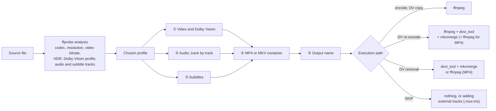
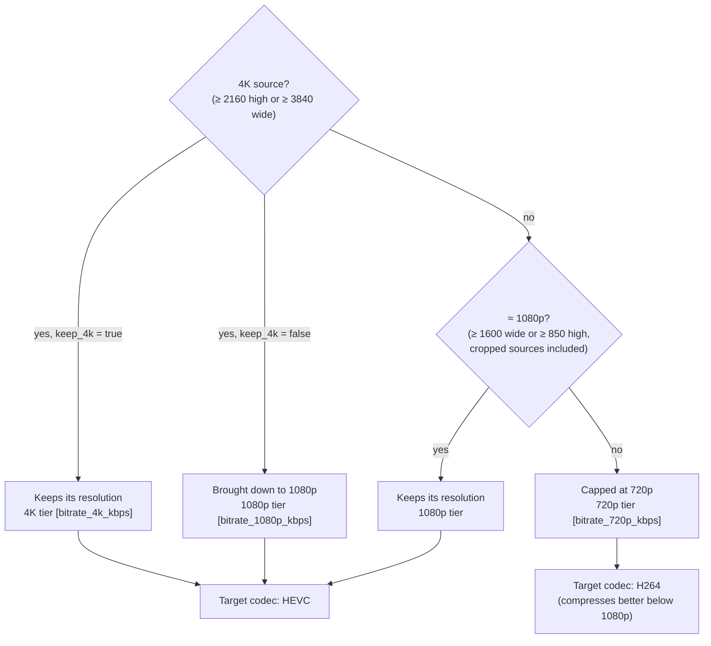
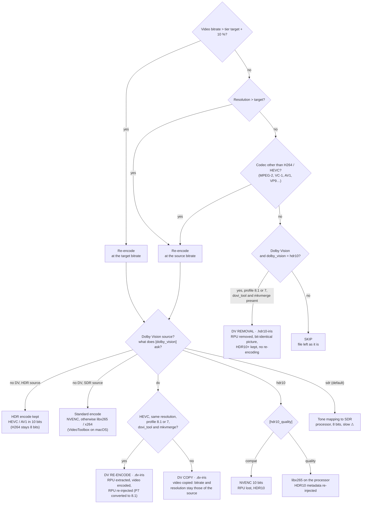
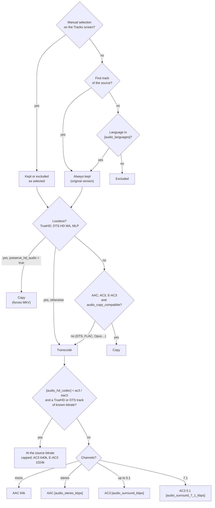
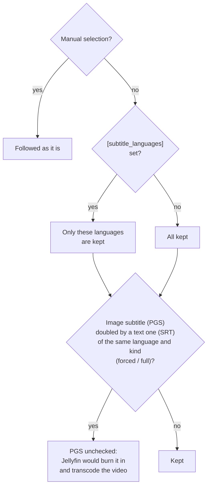
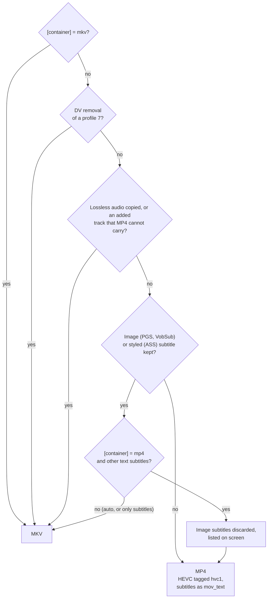

# IRIS ENCODE — Installation guide

**Version**: 0.8.9.94 — Windows (macOS/Linux support planned)

*[Version française : README.fr.md](README.fr.md)*

> This document introduces the project, then covers **installation**. For
> day-to-day use — procedures screen by screen, cases met in practice — see
> [`GUIDE.md`](GUIDE.md). What the project has learned about formats, tools and
> the playback chain lives in `wiki/` (in French).

---

## Why this tool

A movie library today has to reach several screens, and each one accepts a
different subset of the formats a file can carry. The obvious answer —
re-encode everything down to the lowest common denominator — costs hours of
computing per movie and degrades a picture that, most of the time, had no need
to be touched. IRIS ENCODE starts from the opposite assumption: **decide what
needs touching, and touch only that.**

### The playback chain and its constraints

| Link | What it imposes |
|---|---|
| **Jellyfin server** | Any format the client does not declare playable triggers a transcode on every playback. The real cost of a bad format is paid on every viewing, not once. |
| **LG OLED TV (webOS)** | No lossless audio format — neither TrueHD nor DTS-HD MA. The MKV container is unreliable, Dolby Vision profile 8 triggers an HLS remux with audio dropouts, DTS freezes on seek on the 2023 models. |
| **Soundbar over eARC** | It decodes everything, but as soon as the TV mixes its own speakers with it, the TV does the decoding: no lossless bitstream reaches the bar. |
| **iOS clients (Swiftfin)** | Permissive through VLCKit, which plays MKV and DTS. Apple's native player is stricter and cannot switch audio tracks — so it is useless on a multi-language file. |
| **Image subtitles (PGS, VobSub)** | No client can receive them as they are: the server burns them in, which forces a full video transcode. |

The intersection of these constraints is narrow: **HEVC in HDR10, E-AC3
audio, text subtitles**. It is the only set of formats the whole chain accepts
without any machine having to rework anything.

### The choices that follow

- **Do not re-encode by default.** A file whose video bitrate, resolution and
  codec are already within bounds is left untouched. The bitrate compared to
  the threshold is that of the video alone — the container's, audio included,
  would send to re-encoding files whose picture sits well below it.
- **Remove Dolby Vision rather than convert it.** On a profile 8.1, the base
  layer *is* HDR10: removing the metadata is enough. A few minutes, a
  bit-identical picture, instead of hours of re-encoding for a degraded result.
- **Transcode audio at the source bitrate**, rather than at a fixed rate that
  throws away far more than needed on an HD track.
- **Let the container follow the content.** MP4 when everything fits, MKV when
  something would be lost.
- **One profile per destination.** Thresholds, kept languages and the handling
  of Dolby Vision are set per profile, because a living room and a phone do not
  call for the same file.

The rest of the tool follows from there: an interface that **shows its decision
before applying it**, file by file, and lets you overrule it.

## How IRIS decides, file by file

Every file goes through the same decision tree. The chosen profile sets the
thresholds (keys in square brackets); the Tracks screen and the codec key let
you overrule each branch before encoding. The diagrams follow
`core/decision.py` and `core/encoder.py`.

### Overview



### ① Video and Dolby Vision

First the target: the output resolution and the bitrate tier that applies to
it.



Then the tree itself. The first three questions decide whether to re-encode;
the rest says how.



AV1 is never chosen automatically: you ask for it by hand, file by file. A
Dolby Vision source that nothing pushes to re-encoding stays SKIP, Dolby Vision
included, unless removal is possible.

### ② Audio, track by track



A transcode never goes beyond 5.1, and the track title is rewritten so as not
to announce a format that is gone ("TrueHD 7.1 Atmos" becomes "E-AC3 5.1"). A
lossless track transcoded in a file that keeps subtitles goes through a
**separate audio pass** first: without it, ffmpeg produces an empty track
without reporting any error.

### ③ Subtitles



### ④ Container



In `auto`, the container follows the content: MP4 when everything fits, MKV
when something would be lost. A track is never sacrificed silently.

### ⑤ Output name

| Processing | Suffix | Example |
|---|---|---|
| HEVC / H264 / AV1 encode | `.hevc-iris` · `.h264-iris` · `.av1-iris` | `Movie.2160p.x265-GRP.mkv` → `Movie.1080p.hevc-iris.mp4` |
| Dolby Vision kept (re-encoded or copied) | `.dv-iris` | `Movie.2160p.DV.mkv` → `Movie.2160p.DV-iris.mp4` |
| Dolby Vision removal | `.hdr10-iris` | `Movie.2160p.DV.mkv` → `Movie.2160p.HDR10-iris.mp4` |
| SKIP with added tracks | `.mux-iris` | `Movie.mkv` → `Movie.mux-iris.mkv` |

The name says what the file **is**, not what the source was: the codec,
resolution (`2160p` → `1080p`), HDR (`DV` → `HDR10`, all removed in SDR) and
audio (`TrueHD.7.1` → `E-AC3.5.1`) tags are rewritten, the release group is
dropped, and a characteristic already stated is not repeated. Nothing is ever
overwritten: a collision gives `(2)`.

---

## Requirements

| Component | Minimum version | Required |
|-----------|-----------------|----------|
| Windows   | 10 / 11         | ✓        |
| Python    | 3.11            | ✓ (installed automatically if needed) |
| ffmpeg    | 7.x             | ✓ (installed automatically if needed) |
| ffprobe   | 7.x             | ✓ (comes with ffmpeg) |
| dovi_tool | 2.x             | ✗ (optional — Dolby Vision) |
| mkvmerge  | 99.x            | ✗ (optional — adding external tracks) |
| mpv       | recent          | ✗ (optional — playback) |
| NVIDIA GPU | recent driver  | ✗ (recommended — hardware encoding) |

---

## 1. Install Python and its dependencies

### 1.1 Do nothing (recommended)

Double-click **`launch.bat`**. If it finds no usable Python 3.11+, it installs
its own and there is nothing else to do:

```
 [INFO] No usable Python 3.11+ found - setting up the environment.
 No administrator rights needed; everything is written to this folder.

  IRIS ENCODE — Python environment setup
  Downloading uv (x86_64-pc-windows-msvc)…
  uv installed: bin\uv.exe
  Python 3.12…
  .venv environment…
  Dependencies (requirements.txt)…

  Ready — Python 3.12.14 in .venv
```

Allow two to three minutes and about 140 MB the first time. On later runs,
`launch.bat` finds everything in place and starts right away.

**No administrator rights are needed, and nothing is written outside the
application folder** — not to the PATH, not to the registry, not to system
folders. Copying the folder to a USB stick copies the whole installation:

| What arrives | Where |
|---|---|
| `uv`, the executable that fetches the rest | `bin\uv.exe` |
| The CPython interpreter | `bin\python\` |
| The environment and its libraries | `.venv\` |

This is the convention the rest of the tooling already follows: ffmpeg,
mkvmerge and dovi_tool arrive in `bin/` the same way (chapter 3). Python was the
exception for a mechanical reason — the code that downloads the tools *is*
Python, and could not run before it. `bootstrap.ps1` fixes that, in PowerShell.

### 1.2 Which interpreter `launch.bat` picks

In this order, the first that fits:

1. **the local `.venv\`**, if complete — the only one whose library versions
   are known;
2. **the Python on the PATH**, if it reports 3.11 or later — avoids the
   download;
3. **`bootstrap.ps1`** — installs uv, a CPython and the `.venv`.

A suitable system Python is *used*, never replaced. Conversely, if `pip` fails
on that Python (locked-down machine, internal package index, permissions),
`launch.bat` switches to the isolated environment on its own instead of
stopping.

### 1.3 Rebuild the environment

If something went wrong, or after an update of `requirements.txt`:

```
powershell -ExecutionPolicy Bypass -File bootstrap.ps1 -Force
```

`-Force` rebuilds `.venv` from scratch. Without it, the script checks and
downloads nothing again: it is safe to run as often as you like.

### 1.4 If Windows blocks a file (error 4551)

On a *clean* Windows 11 installation, **Smart App Control** is on by default.
It refuses to run binaries without an established reputation, and reports it
as `os error 4551`. `bootstrap.ps1` recognizes this block and names it.

Since v0.8.4.2 it should no longer hit it: the `.venv` is built by the
interpreter's own `venv` module, whose launcher is a known file. If it happens
anyway, two ways out:

- **install Python 3.12 from python.org** (chapter 2): those binaries are
  signed by the Python Software Foundation, and `launch.bat` will pick them;
- **turn off Smart App Control** — *Windows Security* → *App & browser
  control*. Know this before doing it: turning it off is **permanent**, only a
  Windows reinstall turns it back on.

---

## 2. Install Python by hand (optional)

Nothing forces you through chapter 1. A conventionally installed Python is
recognized and used as it is.

Go to **https://www.python.org/downloads/** and download the latest version,
**3.11 or later**. Before *Install Now*, be sure to check:

```
☑  Add Python X.XX to PATH
```

Without this box, `launch.bat` will not see it — and will install its own.

Then, in the application folder:

```
pip install -r requirements.txt
```

| Library         | Role |
|-----------------|------|
| `textual`       | Terminal user interface (TUI) |
| `rich`          | Rich console rendering (colors, tables) |
| `tomli-w`       | Writing TOML files (settings, profiles) |
| `requests`      | Automatic download of ffmpeg and the other tools |
| `beautifulsoup4`| AlloCiné and IMDB lookups for the Info card (`I`) |
| `numpy`         | Audio correlation to resync added tracks |

If `pip` is not found: `python -m pip install -r requirements.txt`. On a
machine with restricted permissions: `pip install --user -r requirements.txt` —
or, more simply, let chapter 1 do the work.

---

## 3. Install ffmpeg

ffmpeg is the video encoding engine. IRIS ENCODE detects it and offers to
download it if it is missing.

### Option A — Automatic installation (recommended)

Start IRIS ENCODE (`launch.bat`). If ffmpeg is missing, the program offers:

```
  [✗] ffmpeg
  Download and install ffmpeg into ./bin/? (y/N):
```

Answer `y`. The download (~30 MB) comes from **gyan.dev** (official Windows
source) and ffmpeg is extracted into the `bin/` folder next to `launch.bat`.

### Option B — Manual installation into `bin/`

1. Download **ffmpeg-release-essentials.zip** from: https://www.gyan.dev/ffmpeg/builds/
2. Extract `ffmpeg.exe` and `ffprobe.exe` from the archive's `bin/` subfolder
3. Put them in the IRIS ENCODE `bin/` folder:
   ```
   iris_encode/
   └── bin/
       ├── ffmpeg.exe
       └── ffprobe.exe
   ```

### Option C — ffmpeg already on the PATH

If ffmpeg is already installed on the system (`ffmpeg` works in a terminal),
IRIS ENCODE detects it — nothing to do.

---

## 4. (Optional) Install the additional tools

Three tools are optional. None is needed to encode: when one is missing, a
feature is turned off; startup is never blocked.

| Tool | Needed for | Size |
|---|---|---|
| `dovi_tool` | **Dolby Vision** content (RPU probe, HDR10 metadata) | ~2 MB |
| `mkvmerge` | **adding external tracks** (dubs, subtitles), **joining parts** (`J`) and check samples | ~22 MB |
| `mpv` | **playing** a file or checking a resync | ~50 MB |

### Option A — Automatic installation (recommended)

On first start, IRIS ENCODE offers to install each missing tool:

```
  dovi_tool missing (optional — needed for Dolby Vision).
  Download and install dovi_tool (Dolby Vision) into ./bin/? (y/N):
```

Answer `y`. The binary is downloaded from its official source, checked against
its SHA256 fingerprint, then extracted into `bin/`.

> `mpv` is only published as a `.7z` archive: extraction goes through the
> `tar` that ships with Windows 10/11, with no extra dependency.

### Option B — Manual installation into `bin/`

Download the Windows binaries and put the executables directly in `bin/` (no
subfolder):

| Tool | Source |
|---|---|
| `dovi_tool.exe` | https://github.com/quietvoid/dovi_tool/releases |
| `mkvmerge.exe` | https://mkvtoolnix.download/downloads.html (64-bit ZIP archive) |
| `mpv.exe` | https://mpv.io/installation/ (portable Windows build) |

```
iris_encode/
└── bin/
    ├── dovi_tool.exe
    ├── mkvmerge.exe
    └── mpv.exe
```

> A tool already on the system PATH is detected automatically — nothing to do.

---

## 5. Start IRIS ENCODE

Double-click **`launch.bat`** or run in a terminal:

```
launch.bat
```

The launcher checks, and installs what is missing:
- a newer IRIS ENCODE published on GitHub — it offers to install it (§ 5.2);
- a usable Python 3.11+ — otherwise it installs one (chapter 1);
- the Python dependencies listed in `requirements.txt`;
- ffmpeg / ffprobe, downloaded into `bin/` when first needed;
- the validity of the settings.

The first start is the longest: it downloads what is missing. Later ones take a
few seconds.

**One last step, once everything runs**: § 5.1 makes an "IRIS ENCODE" shortcut
on the Desktop, which opens the application in Windows Terminal — the only host
that renders it correctly (chapter 10). That is how you use it from then on;
`launch.bat` stays there for troubleshooting.

The interface language is set in the options (`F5`, then `U`). On the very
first start, IRIS ENCODE takes the Windows display language if it is
translated, English otherwise.

### 5.1 Desktop shortcut: IRIS_Encode.exe (optional)

A shortcut pointing straight at `launch.bat` opens in the legacy console
(conhost), with degraded rendering (chapter 10). The repository provides what
is needed to compile a small native launcher whose only job is to open
`launch.bat` in **Windows Terminal** — and, failing that, in a classic console.

1. Double-click **`launcher\build.bat`**.
2. The script decodes the icon (`launcher\iris.ico.b64` → `iris.ico`, through
   `certutil`, which ships with Windows), compiles `launcher\IrisEncodeLauncher.cs`
   with the C# compiler that also ships with Windows (the .NET Framework 4.x
   `csc.exe` — nothing to install) and produces **`IRIS_Encode.exe`** at the
   project root, icon included.
3. It then offers to create the "IRIS ENCODE" shortcut on the Desktop.

The binary is **not versioned**: an `.exe` in a repository cannot be checked,
so everyone compiles their own from the source — about thirty lines, which are
the reference. After an update of the launcher, running `launcher\build.bat`
again is enough.

> On a *clean* Windows 11 installation, **Smart App Control** may refuse an
> executable without reputation, even one compiled locally — the same family of
> blocks as in chapter 1.4. In that case, a `.lnk` shortcut without an `.exe`
> does the same job, with this target:
> `wt.exe -d "C:\path\to\iris_encode" cmd /c launch.bat`
> (icon of your choice through *Properties* → *Change Icon* →
> `launcher\iris.ico`, present once `build.bat` has run).

### 5.2 Updates

On every start — at most one query to GitHub per hour — the launcher compares
your version with the **latest published release** (the one marked "Latest"),
never with an intermediate state of the code. If it is newer:

```
  Update available: v0.8.9.1 → v0.9.0.0
  Install now? [Y/n]
```

The launchers are in English: they run before the application's language is
known. `Enter` (or `y`, `o`, `oui`) downloads the archive, checks its SHA256
fingerprint, replaces the application files and restarts IRIS ENCODE on the
new version. `n` postpones. A failure (network, archive rejected) never
prevents startup: the installed version opens, and the previous one is
restored if the replacement had begun.

**What is never touched**: `config.toml`, `profiles.toml`, `bin/`, `.venv/`.
The replaced version is kept in `.iris_update/sauvegarde/` until the next
update.

| `config.toml`, `[updates] app =` | Effect |
|---|---|
| `"ask"` (default) | ask, `Y` preselected |
| `"auto"` | install without asking |
| `"off"` | check nothing, no network call |

A folder cloned with git (a `.git/` is present) is never updated this way:
`git pull` takes care of it. If the Desktop launcher has changed, run
`launcher\build.bat` again as shown on screen.

> **From a version older than v0.8.9.1**, the update is done by hand one last
> time: download the release archive and extract it over the folder. Later ones
> happen on their own.

---

## 6. File layout

```
iris_encode/
├── launch.bat          ← Windows entry point (double-click)
├── IRIS_Encode.exe     ← Desktop launcher, compiled by launcher\build.bat (auto)
├── bootstrap.ps1       ← Installs Python and its dependencies, no admin rights
├── updater.py          ← Update from the GitHub release (called by launch.bat)
├── main.py             ← Python entry point
├── config.toml         ← General settings (editable)
├── profiles.toml       ← Encoding profiles (editable)
├── requirements.txt    ← Python dependencies
├── version.py          ← Application version (single source)
├── LICENSE             ← GPL-3.0-or-later license
├── README.md           ← This guide (README.fr.md: French)
├── GUIDE.md            ← User guide (GUIDE.fr.md: French)
├── .venv/              ← Local Python environment (auto)
├── .iris_update/       ← Update cache, backup and manifest (auto)
├── bin/                ← uv / python / ffmpeg / ffprobe / dovi_tool / mkvmerge / mpv (auto)
├── data/               ← Download sources (shipped)
├── launcher/           ← Desktop launcher: C# source, icon, build.bat
├── core/               ← Business logic
├── tui/                ← User interface
├── locales/            ← Interface translations (.po, compiled .mo)
├── outils/             ← Development tools (translations)
├── tests/              ← Tests and TUI smoke test
└── logger/             ← Logging module
```

---

## 7. Customization

`config.toml` and `profiles.toml` can be edited by hand with any text editor
(Notepad, VS Code, etc.).

**`config.toml`** — column widths, language, paths, online service keys:
```toml
[app]
language = "en"       # interface language: "en", "fr" (also in F5, then U)

[tui.browser.columns]
# The "file" column stretches to the space available
taille       = 8      # file size column width
resolution   = 12     # resolution column width
audio        = 20     # audio tracks column width
decision     = 12     # decision column width

[meta]
omdb_api_key = ""     # free key at omdbapi.com (full IMDB data)

[opensubtitles]       # subtitles from F9, key O (see GUIDE § 2.3)
api_key  = ""         # application key: opensubtitles.com/consumers
username = ""         # account, required to download (20 / day free)
password = ""
```

The setting keys (`taille`, `resolution`…) are identifiers: they are written as
shown, whatever the interface language.

**`profiles.toml`** — encoding profiles (bitrate, resolution, audio, Dolby
Vision):
```toml
[series_basic]
bitrate_1080p_kbps = 2500
keep_4k            = false
dolby_vision       = "hdr10"
```

---

## 8. Keyboard shortcuts (Home screen)

The main ones; the full list, screen by screen, is in [`GUIDE.md`](GUIDE.md)
§ 2, and `H` shows it inside the application.

| Key | Action |
|-----|--------|
| `Space` | Check / uncheck a file |
| `A` / `N` | Check all / none |
| `Enter` | Open a folder; on a file, the guided mode (or the Tracks screen in manual mode) |
| `Backspace` | Go up one level |
| `W` | Switch between guided and manual mode |
| `T` | Tracks screen: manual track selection (audio, subtitles) |
| `F1` | Dry run — what will be done, without doing anything |
| `F2` | Encode the checked files |
| `R` | Encode the folder under the cursor and all its subfolders |
| `F4` | Change the encoding profile |
| `F5` | Manage profiles (create `N`, edit `E`, delete `D`) |
| `J` | Join the checked files end to end into one (`part1` + `part2`) |
| `I` | Movie Info card: AlloCiné, then IMDB with `Tab` |
| `Tab` / `Shift+Tab` | Next / previous column (resizing) |
| `<` / `>` | Narrow / widen the active column |
| `H` | Key guide |
| `F10` | Quit |

---

## 9. IMDB metadata (`I`, then `Tab`)

IMDB blocks direct scraping. IRIS ENCODE works in two modes:

- **Without a key**: partial data through IMDB's suggestion API (title, year,
  type, main cast)
- **With an OMDb key**: full data (rating, director, synopsis, genres)

To get a free key (1,000 requests/day): at startup, if it is missing, a window
asks for it — **Get a key** opens
[omdbapi.com](https://www.omdbapi.com/apikey.aspx), you paste the key received
by email, and it is checked before being saved. Later: `F5`, then `K`.
`config.toml` does not need editing by hand.

---

## 10. Recommended terminal

IRIS ENCODE uses Textual for its text interface. Rendering depends on the
**terminal host**, not on the shell (cmd or PowerShell).

| Terminal | Rendering | Notes |
|----------|-----------|-------|
| **Windows Terminal** | ✓ Optimal | Recommended — full VT100/ANSI, native Unicode |
| **PowerShell** in Windows Terminal | ✓ Optimal | The shell does not matter, the host does |
| **cmd.exe** in Windows Terminal | ✓ Optimal | Same |
| **cmd.exe** classic window (conhost) | ⚠ Degraded | Partial ANSI support, approximate borders |
| **PowerShell** classic window (conhost) | ⚠ Variable | Same limitation as classic cmd |

> **Windows Terminal** is free on the Microsoft Store and installed by default
> on Windows 11. For Windows 10: https://aka.ms/terminal

A double-click on `launch.bat`, or a shortcut aimed straight at it, opens the
**legacy console** — the degraded row of the table. That is the reason for the
Desktop shortcut in § 5.1: it does nothing but start the application *in the
right host*. If you remember one thing from this chapter, make it that one.

---

## 11. Troubleshooting

| Symptom | Likely cause | Fix |
|---------|--------------|-----|
| `python` not recognized | Python not on the PATH | Reinstall Python with *Add to PATH* checked |
| `pip` not recognized | pip missing | Use `python -m pip` |
| Black screen at startup | The terminal cannot display the TUI | Use Windows Terminal or the classic cmd.exe |
| Slow encoding | No NVIDIA GPU detected | Normal — processor encoding is used automatically |
| `dovi_tool missing` | Optional tool not installed | See chapter 4 — only for Dolby Vision files |
| Error importing a module | Missing dependencies | Run `pip install -r requirements.txt` again |
| `os error 4551` during installation | Smart App Control rejects a binary without reputation | See chapter 1.4 |
| Windows blocks `IRIS_Encode.exe` | Smart App Control, same cause as 1.4 | The `.lnk` shortcut without `.exe` from § 5.1 does the same job |
| `csc.exe` not found during build | .NET Framework 4.x turned off | Windows *Optional features*, or https://aka.ms/net48 |
| The shortcut opens a black console | Windows Terminal missing: the launcher falls back to `cmd` | Install Windows Terminal (chapter 10) |
| IMDB: no rating/synopsis | OMDb key not set | See chapter 9 |

---

## 12. Uninstalling

IRIS ENCODE changes no system setting. To uninstall:

1. Delete the `iris_encode/` folder
2. (Optional) Uninstall the Python libraries: `pip uninstall textual rich tomli-w requests beautifulsoup4 numpy`

`config.toml` and `profiles.toml` go with the folder.

---

## 13. License

IRIS ENCODE is free software, distributed under the **GNU General Public
License, version 3 or any later version** (GPL-3.0-or-later). The full text is
in [`LICENSE`](LICENSE).

The external tools (ffmpeg, mkvmerge, mpv, dovi_tool, uv) are not shipped with
IRIS ENCODE: they are downloaded into `bin/` from their official sources and
each keeps its own license.

---

*IRIS ENCODE — Interface Relationnelle d'Intelligence Servicielle*
