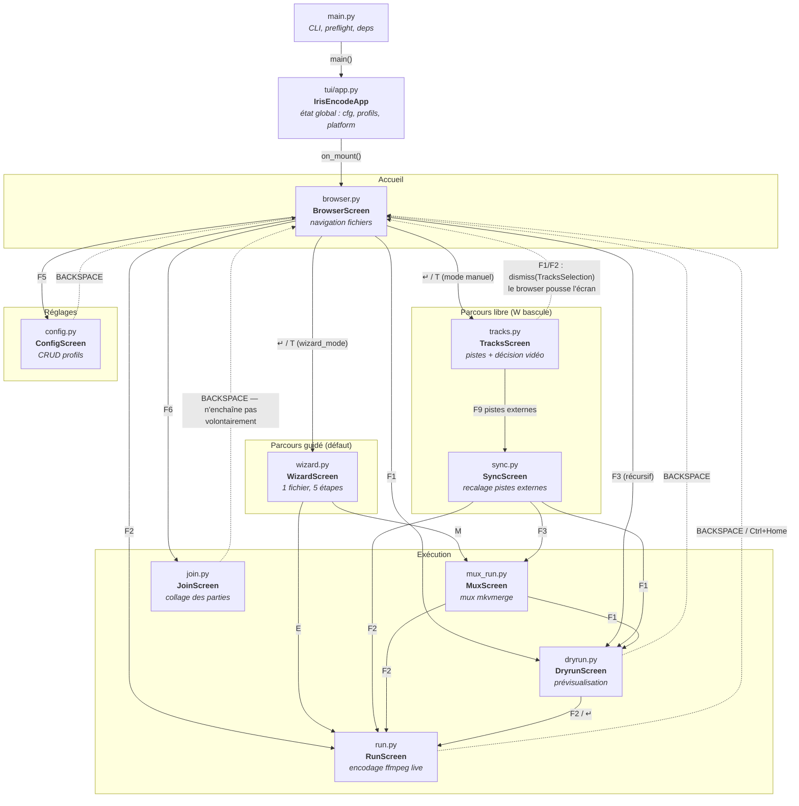
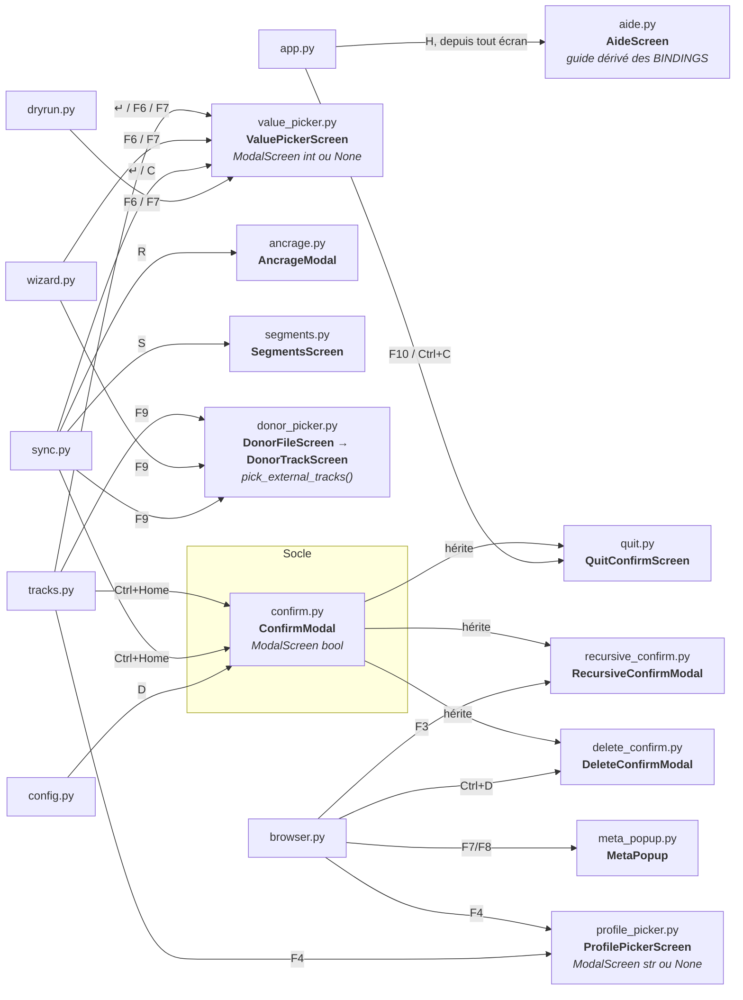
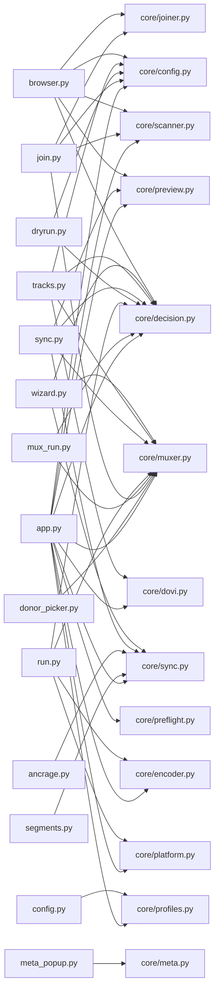

# Carte des écrans — IRIS ENCODE

Relation entre les écrans de la TUI et les fichiers `.py` qui les décrivent.
Document **dérivé du code** (`tui/app.py`, `tui/screens/*.py`) : chaque flèche
correspond à un `push_screen` / `dismiss` réel, chaque touche à un `Binding`.

---

## 1. Graphe de navigation

### Modales (empilées sur l'écran courant, rendent une valeur)

---

## 2. Écran ↔ fichier ↔ rôle

| Écran (classe) | Fichier | Type | Lignes | Rôle |
|---|---|---|---|---|
| `IrisEncodeApp` | `tui/app.py` | `App` | 175 | État global (cfg, profils, platform), câblage des binaires, `F10`/`H` |
| `BrowserScreen` | `tui/screens/browser.py` | `Screen` | 1073 | Accueil : navigation fichiers, sélection, scan, lancement de tout le reste |
| `WizardScreen` | `tui/screens/wizard.py` | `Screen` | 596 | Assistant autonome : un fichier, cinq étapes, `↵` pour avancer |
| `TracksScreen` | `tui/screens/tracks.py` | `Screen[TracksSelection\|None]` | 767 | Sélection pistes + édition de la décision vidéo (3 sections dans un `DataTable`) |
| `SyncScreen` | `tui/screens/sync.py` | `Screen[list[ExternalTrack]\|None]` | 1199 | Recalage manuel des pistes externes avant mux (mesure, ancrage, segments) |
| `DryrunScreen` | `tui/screens/dryrun.py` | `Screen` | 427 | Prévisualisation des décisions pour tous les fichiers sélectionnés |
| `RunScreen` | `tui/screens/run.py` | `Screen` | 1022 | File d'encodage ffmpeg avec progression live, pause, skip |
| `MuxScreen` | `tui/screens/mux_run.py` | `Screen[bool]` | 226 | Exécution du mux mkvmerge (chemin distinct de la file d'encodage) |
| `JoinScreen` | `tui/screens/join.py` | `Screen[bool]` | 343 | Collage bout à bout des parties d'un film ; s'arrête au fichier produit |
| `ConfigScreen` | `tui/screens/config.py` | `Screen[bool]` | 329 | Gestion des profils (`profiles.toml`), intègre `ProfileForm` |
| `AideScreen` | `tui/screens/aide.py` | `Screen` | 407 | Guide dérivé des `BINDINGS` de chaque écran — pas de liste écrite à la main |
| `ConfirmModal` | `tui/screens/confirm.py` | `ModalScreen[bool]` | 140 | Socle de toutes les confirmations |
| `QuitConfirmScreen` | `tui/screens/quit.py` | ← `ConfirmModal` | 23 | Sortie (focus initial sur Annuler) |
| `DeleteConfirmModal` | `tui/screens/delete_confirm.py` | ← `ConfirmModal` | 30 | Suppression d'un fichier |
| `RecursiveConfirmModal` | `tui/screens/recursive_confirm.py` | ← `ConfirmModal` | 30 | Scan/encodage récursif |
| `ValuePickerScreen` | `tui/screens/value_picker.py` | `ModalScreen[int\|None]` | 96 | Liste de valeurs générique (codec, débit, langue…) |
| `ProfilePickerScreen` | `tui/screens/profile_picker.py` | `ModalScreen[str\|None]` | 142 | Choix de profil en table (remplace un `ValuePicker` paddé à la main) |
| `MetaPopup` | `tui/screens/meta_popup.py` | `ModalScreen` | 159 | Fiche IMDB / AlloCiné |
| `AncrageModal` | `tui/screens/ancrage.py` | `ModalScreen[tuple[float,float]\|None]` | 154 | Point de repère quand la corrélation ne peut pas mesurer seule |
| `SegmentsScreen` | `tui/screens/segments.py` | `ModalScreen[None]` | 134 | Détail lecture seule des plages de décalage détectées |
| `DonorFileScreen` / `DonorTrackScreen` | `tui/screens/donor_picker.py` | `ModalScreen` ×2 | 264 | Fichier donneur puis ses pistes (tid mkvmerge, jamais index ffprobe) |

### Support transverse (pas des écrans)

| Fichier | Lignes | Rôle |
|---|---|---|
| `tui/common.py` | 446 | Formatage, styles DV, options des pickers, groupes de raccourcis |
| `tui/mixins.py` | 247 | `TableNavMixin` (Home/End/PgUp/PgDn), `ColumnResizeMixin` (Tab, `<`/`>`, persistance) |
| `tui/widgets/entete.py` | 66 | `Entete` — header + rappel de la touche d'aide, en un seul widget |
| `tui/widgets/footer.py` | 188 | `KeyFooter` — raccourcis en trois bandes (écran / globaux / F1-F10) |
| `tui/widgets/file_tree.py` | 123 | `FileNavigator` — accès système de fichiers pour le browser |
| `tui/widgets/profile_form.py` | 617 | Formulaire CRUD profil, utilisé par `ConfigScreen` |

---

## 3. Écrans → modules `core`

---

## 4. Lectures utiles du graphe

- **`BrowserScreen` est le seul hub.** Tous les retours (`BACKSPACE`, `Ctrl+Home`)
  y reviennent, et c'est lui qui pousse `DryrunScreen`/`RunScreen` même quand la
  demande vient de `TracksScreen` — celui-ci se contente de `dismiss()` une
  `TracksSelection` portant un `launch_mode`. L'écran des pistes n'a donc pas
  besoin de connaître les écrans d'exécution.
- **Deux parcours concurrents vers le même point.** `WizardScreen` (défaut) et
  la chaîne `TracksScreen → SyncScreen` (mode manuel, bascule `W`) aboutissent
  tous deux à `MuxScreen` ou `RunScreen`. Le wizard est **autonome**, pas un
  enchaînement des écrans existants.
- **`ConfirmModal` est le seul socle de confirmation**, décliné trois fois par
  héritage. Toute nouvelle confirmation devrait en hériter plutôt que
  reconstruire une modale.
- **`ValuePickerScreen` est le point d'entrée d'édition partagé** de `tracks`,
  `sync`, `dryrun` et `wizard` — modifier ses options touche quatre écrans.
- **`AideScreen` est dérivé, pas rédigé** : il importe les `BINDINGS` de neuf
  écrans et échoue en test (`tests/test_aide.py`) si une touche est ajoutée sans
  explication. C'est la seule dépendance « inverse » du graphe : l'aide dépend
  de tous les écrans, aucun écran ne dépend d'elle.
- **`JoinScreen` s'arrête volontairement** au fichier produit là où `MuxScreen`
  enchaîne sur dry-run/encodage : le fichier recousu redevient une entrée
  ordinaire du browser.
